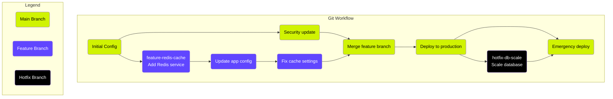
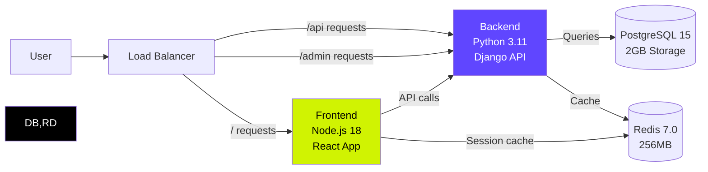

It was 11:47 PM on a Friday when Sarah's phone buzzed. The authentication system was down, and customers couldn't login and use the product. After two hours of frantic debugging, the culprit emerged: someone had "temporarily" changed a security rule in the deployment dashboard three weeks ago and forgotten to document it. The staging environment worked perfectly because it still had the old configuration. Production? Nobody remembered what settings had been changed.

This scenario happens more often than teams want to admit. Click-and-deploy platforms promise simplicity, but they create a dangerous illusion. What starts as a quick deployment becomes a web of undocumented changes, tribal knowledge, and configuration drift that can bring down your application or parts of it when you least expect it.

The truth is that infrastructure, like code, needs version control, peer review, and reproducible builds. For teams serious about reliability and scale, **configuration as code isn't just better, it's essential**.

## The Configuration Drift Problem

### What Happens When Infrastructure Lives in GUIs

Modern deployment platforms make it tempting to treat infrastructure like a point-and-click adventure. Need to add an environment variable? Click here. Want to change the build command? Update this field. Scale up resources? Drag this slider.

Each change feels harmless in isolation. But over time, your infrastructure accumulates invisible complexity. Team members make quick fixes without documentation. Settings drift between environments. Knowledge gets trapped in individual memories rather than shared systems.

Consider a typical scenario: Your team deploys a React application to production using a popular frontend platform. The initial setup takes five minutes. Six months later, you have:

- Environment variables set directly in the dashboard
- Build configurations that differ between staging and production
- Security headers configured through various interface panels
- Resource allocations adjusted by different team members
- Integration settings spread across multiple configuration screens

When something breaks, you face an archaeological expedition through interface panels, trying to reconstruct what actually runs in production.

### Real-World Scenario: The Friday Deployment Disaster

Let's follow a real team through a typical configuration drift disaster. TechFlow, a growing SaaS company, built their customer dashboard using a click-and-deploy platform. The initial deployment was smooth-their frontend deployed automatically from GitHub, and the team loved the simplicity.

As the product evolved, the team made incremental changes:

- Marketing requested A/B testing capabilities, so they added feature flags through the platform's interface
- The security team required custom headers, configured through the dashboard's security panel
- Performance optimization led to CDN settings adjusted across multiple interface screens
- Compliance requirements meant new environment variables for data handling

Three months later, during a critical product launch, the team needed to quickly replicate their production environment for a high-stakes demo. What should have been a simple environment copy became a two-day emergency project.

The staging environment, supposedly identical to production, behaved completely differently. Customer authentication failed, API calls threw errors, and the demo crashed during the presentation. The team spent the weekend manually comparing dozens of configuration screens, trying to identify differences between environments and debug the environment.

The root cause? Eighteen separate configuration changes made through various dashboard interfaces, with no audit trail or documentation. Each change seemed minor at the time, but collectively they created an unreproducible system.

### The Scaling Tipping Point

Every team hits a threshold where click-and-deploy becomes a liability rather than an asset. The tipping point usually occurs when:

**Team Size Exceeds 3-5 Developers**: Multiple people making infrastructure changes without coordination leads to conflicts and confusion. Without version control, you can't track who changed what or why.

**Multiple Environments Become Critical**: Development, staging, production, features and demo environments need to stay synchronized. Manual configuration management across environments becomes error-prone and time-consuming.

**Compliance Requirements Emerge**: SOC2, HIPAA, or GDPR audits require documentation of infrastructure changes. Screenshots of dashboard settings don't meet audit standards.

**Integration Complexity Grows**: Modern applications integrate with databases, APIs, monitoring tools, and external services. Managing these connections through GUI interfaces becomes unwieldy.

**Deployment Frequency Increases**: Teams deploying multiple times per day need predictable, automated infrastructure management. Click-and-deploy workflows become bottlenecks.

## Configuration as Code: The Professional Approach

### Core Principles

Configuration as code treats infrastructure definitions like software-versioned. Reviewed, tested, and deployed through automated processes. This approach follows four fundamental principles:

**Everything in Version Control**: Infrastructure configurations live in Git repositories alongside application code. Every change creates a commit with an author, timestamp, and description. You can track the complete evolution of your infrastructure.

**Reproducible Environments**: Given the same configuration files, you can recreate identical environments. This eliminates the "works on my machine" problem for infrastructure and enables reliable disaster recovery.

**Reviewable Infrastructure Changes**: Infrastructure modifications go through the same peer review process as code changes. Pull requests allow team members to discuss, validate, and approve infrastructure changes before they reach production.



*Git workflow for infrastructure changes: Every modification is versioned, reviewed, and auditable*

**Declarative Configuration**: You describe what you want your infrastructure to look like, not the steps to create it. The platform handles the implementation details, ensuring consistent results.

### Upsun's YAML Approach in Action

Upsun implements configuration as code through YAML files that live in your application repository. Here's how a multi-service application looks in practice:

```yaml {filename=".upsun/config.yaml"}
applications:
  frontend:
    source:
      root: "frontend"
    type: "nodejs:18"
    build:
      flavor: none
    hooks:
      build: |
        npm ci
        npm run build
        npm run test:unit
      deploy: |
        npm run migrate:data
    web:
      commands:
        start: "npm start"
      locations:
        "/":
          root: "dist"
          index: ["index.html"]
        "/api":
          passthru: true
    relationships:
      backend: "api:http"
      cache: "redis:redis"
    variables:
      env:
        NODE_ENV: "production"
        API_BASE_URL: $API_BASE_URL

  backend:
    source:
      root: "backend"
    type: "python:3.11"
    hooks:
      build: |
        pip install -r requirements.txt
        python manage.py collectstatic --noinput
      deploy: |
        python manage.py migrate --noinput
    web:
      commands:
        start: "gunicorn myapp.wsgi:application"
    relationships:
      database: "db:postgresql"
      cache: "redis:redis"
    variables:
      env:
        SECRET_KEY: $SECRET_KEY

services:
  db:
    type: postgresql:15
    disk: 2048
    configuration:
      max_connections: 200
      shared_buffers: "256MB"

  redis:
    type: redis:7.0
    configuration:
      maxmemory: "256mb"
      maxmemory-policy: "allkeys-lru"

routes:
  "https://{default}/":
    type: upstream
    upstream: "frontend:http"
    cache:
      enabled: true
      default_ttl: 3600

  "https://{default}/api/":
    type: upstream
    upstream: "backend:http"
    cache:
      enabled: false

  "https://{default}/admin/":
    type: upstream
    upstream: "backend:http"
    cache:
      enabled: false
```

This configuration file tells a complete story about your application architecture. Anyone can read it and understand:

- How services connect to each other
- What databases and caching layers exist
- How traffic routes between components
- What happens during build and deployment
- How different environments should behave



*Multi-service architecture visualization: How the YAML configuration maps to actual infrastructure*

### Benefits of Configuration as Code

This YAML-driven approach delivers immediate practical benefits:

**Clear Dependency Mapping**: The `relationships` section explicitly shows how services connect. You can see at a glance that the frontend talks to the backend, and the backend uses both PostgreSQL and Redis.

**Environment Parity Guaranteed**: The same YAML files deploy to development, staging, and production. Environment-specific differences are handled through variables, not different configurations.

**Infrastructure Changes Reviewed Like Code**: Modifying infrastructure means editing YAML files and creating pull requests. Your team reviews infrastructure changes with the same rigor as application changes.

**Deployment Automation and Rollback**: Deployments become deterministic processes based on Git commits. Rolling back infrastructure changes is as simple as reverting commits.

**Documentation That Stays Current**: The YAML files serve as always-up-to-date documentation of your infrastructure. Unlike wiki pages or README files, this documentation can't drift from reality.

## Comparative Analysis: YAML vs. Click-and-Deploy

### Developer Experience Comparison

The differences between configuration as code and click-and-deploy become apparent in day-to-day development scenarios:

| Aspect | Click-and-Deploy | Configuration as Code |
|--------|------------------|----------------------|
| **Initial Setup** | 5 minutes of clicking through wizards | 30 minutes writing YAML configuration **(only the first time)** |
| **Adding New Service** | 10 clicks across multiple screens, changes undocumented | 5 lines of YAML in pull request with peer review |
| **Environment Replication** | Manual recreation, often with subtle differences | `git clone` followed by automated deployment |
| **Team Onboarding** | Screen sharing session or outdated documentation | Read the configuration files in the repository |
| **Rollback Speed** | Manual reconfiguration through dashboards | `git revert` followed by automated redeployment |
| **Audit Trail** | Platform logs (if comprehensive) | Complete Git history with commit messages |
| **Change Approval** | Tribal knowledge and Slack messages | Formal pull request review process |
| **Configuration Drift** | Inevitable as team makes undocumented changes | Impossible-all changes are versioned |

### Enterprise Scenarios Where Configuration as Code Wins

**Compliance Requirements**: When auditors ask for documentation of infrastructure changes, you need more than screenshots of dashboard settings. Configuration as code provides the audit trail that compliance frameworks require. Every change has an author, reviewer, timestamp, and business justification in the commit message.

**Multi-Region Deployment**: Global applications need consistent configuration across multiple regions. With click-and-deploy platforms, you manually replicate settings across different regional dashboards. Configuration as code lets you deploy identical infrastructure to multiple regions from the same YAML files.

**Disaster Recovery**: When your primary environment goes down, you need to recreate your infrastructure quickly and accurately. Configuration as code enables complete environment recreation from version control-no guesswork, no missing settings, no manual configuration steps.

**Change Management**: Large organizations need approval workflows for infrastructure modifications. Configuration as code integrates with existing code review processes, allowing infrastructure changes to follow the same governance as application changes.

### The Hidden Technical Debt of GUI Configuration

Click-and-deploy platforms create technical debt that compounds over time:

**Knowledge Silos**: Critical infrastructure knowledge gets trapped in individual team members' minds rather than documented in shared systems. When those team members leave, the knowledge leaves with them.

**Integration Challenges**: Modern DevOps requires infrastructure integration with CI/CD pipelines, monitoring systems, and deployment automation. GUI-based configuration creates integration gaps that require manual workarounds.

**Limited Automation**: You can't easily automate changes to GUI-configured infrastructure. This limits your ability to implement advanced deployment strategies, automated scaling, or self-healing systems.

**Testing Difficulties**: Infrastructure changes need testing just like code changes. With GUI configuration, you can't implement infrastructure testing, validate changes in isolated environments, or run automated compliance checks.

## Advanced Upsun Capabilities

### Environment Branching Strategy

Upsun extends Git's branching model to infrastructure, creating powerful workflows for development teams:

```yaml {filename=".upsun/config.yaml"}
# Different configurations can be activated based on Git branches
hooks:
  build: |
    if [ "$PLATFORM_BRANCH" = "main" ]; then
      npm run build:production
    else
      npm run build:development
    fi
  deploy: |
    # Run database migrations in production
    if [ "$PLATFORM_BRANCH" = "main" ]; then
      npm run migrate:deploy
    else
      # For development branches, you might seed the database
      npm run db:seed
    fi
```

This branching strategy enables sophisticated development workflows:

- **Feature Branch Environments**: Every feature branch gets its own complete environment with isolated databases and services
- **Database Cloning**: Preview environments include cloned production data with automatic sanitization for privacy compliance  
- **Network Isolation**: Each environment runs in isolation, preventing cross-environment interference
- **Automated Cleanup**: Environments automatically clean up when branches are deleted, preventing resource waste

### Integration with Development Workflow

Configuration as code integrates seamlessly with modern development practices:

```yaml {filename=".upsun/config.yaml"}
hooks:
  build: |
    set -e
    # Install dependencies
    npm ci
    
    # Run tests
    npm run test:unit
    if [ $? -ne 0 ]; then
      echo "Unit tests failed, aborting build"
      exit 1
    fi
    
    # Build application
    npm run build
    
    # Run integration tests
    npm run test:integration
    if [ $? -ne 0 ]; then
      echo "Integration tests failed, aborting build"
      exit 1
    fi
    
    # Security scanning
    npm audit --audit-level=high
    
  deploy: |
    # Database migrations
    npm run migrate:deploy
    
    # Cache warming
    npm run cache:warm
    
    # Health check
    curl -f http://localhost/health || exit 1
    
    # Notify monitoring systems
    curl -X POST $DEPLOYMENT_WEBHOOK_URL \
      -H "Content-Type: application/json" \
      -d "{\"status\":\"deployed\",\"commit\":\"$PLATFORM_TREE_ID\"}"
```

These hooks ensure that every deployment follows the same quality gates, testing procedures, and notification processes-automatically and consistently.

## Migration Strategy: From Click-and-Deploy to Configuration as Code

### Assessment Phase

Before migrating to configuration as code, inventory your current infrastructure setup:

**Document Existing Configurations**: Export or screenshot current platform settings. Many teams discover they have more configuration complexity than they realized.

**Map Service Dependencies**: Identify how your applications connect to databases, APIs, and external services. This mapping becomes the foundation for your YAML configuration.

**Identify Team Knowledge Gaps**: Determine which infrastructure knowledge exists only in individual team members' minds. This knowledge needs to be captured in configuration files.

**Evaluate Compliance Requirements**: Understand your organization's audit, security, and governance needs. Configuration as code can address many compliance requirements that GUI-based systems cannot.

### Gradual Migration Approach

Teams don't need to migrate everything at once. A phased approach reduces risk and builds confidence:

**Start with New Projects**: Use Upsun for new applications while keeping existing projects on their current platforms. This approach lets teams learn configuration as code without migration pressure.

**Convert Non-Critical Applications First**: Move development tools, internal dashboards, or documentation sites before touching revenue-critical applications.

**Migrate Development Environments Before Production**: Set up development and staging environments on Upsun while keeping production on the existing platform. This approach provides a safety net during the learning process.

**Plan Production Migration During Low-Risk Periods**: Schedule production migrations during maintenance windows or low-traffic periods.

### Measuring Success

Track metrics that demonstrate the value of configuration as code:

**Deployment Frequency and Reliability**: Measure how often you deploy and how often deployments succeed. Configuration as code typically increases deployment frequency while reducing failure rates.

**Time to Environment Creation**: Track how long it takes to create new environments. Configuration as code dramatically reduces environment setup time.

**Mean Time to Recovery**: Measure how quickly you can recover from incidents. Version-controlled infrastructure enables faster rollbacks and more predictable recovery procedures.

**Developer Satisfaction and Velocity**: Survey your team about deployment confidence and development velocity. Configuration as code typically improves both metrics significantly.

## Compliance and Security Benefits

Configuration as code provides security and compliance advantages that GUI-based systems cannot match:

### Audit Trail and Governance

Every infrastructure change creates a permanent audit trail with:
- **Who**: Git commit author and reviewer identities
- **What**: Exact changes made to configuration
- **When**: Precise timestamps for all modifications  
- **Why**: Commit messages explaining business justification
- **How**: Pull request discussions showing decision process

This audit trail meets the documentation requirements for SOC2, HIPAA, GDPR, and other compliance frameworks.

### Security Through Review

Infrastructure changes go through the same security review process as code changes:

```yaml {filename=".upsun/config.yaml"}
# Security configurations are explicit and reviewable
web:
  headers:
    Strict-Transport-Security: "max-age=31536000; includeSubDomains"
    X-Content-Type-Options: "nosniff"
    X-Frame-Options: "DENY"
    X-XSS-Protection: "1; mode=block"
    Content-Security-Policy: "default-src 'self'; script-src 'self' 'unsafe-inline'"
  
variables:
  env:
    # Secrets management through secure variables
    API_SECRET_KEY: $API_SECRET_KEY
    ENCRYPTION_KEY: $ENCRYPTION_KEY
```

Security misconfigurations become visible in pull requests, allowing team members to catch problems before they reach production.

### Reproducible Security Posture

Configuration as code ensures consistent security settings across all environments. You can't accidentally deploy to production with development-level security settings when your configuration is version-controlled.

## When to Make the Switch

### Signs Your Team Has Outgrown Click-and-Deploy

Several indicators suggest it's time to move beyond GUI-based deployment platforms:

**Configuration Drift Incidents**: If you've experienced production issues caused by undocumented infrastructure changes, you need better configuration management.

**Environment Synchronization Problems**: When staging and production behave differently despite being "identical," you have a configuration management problem.

**Onboarding Difficulties**: If new team members struggle to understand your infrastructure setup, you need better documentation-which configuration as code provides automatically.

**Deployment Anxiety**: Teams shouldn't fear deployments. If your deployments are unpredictable or stressful, configuration as code can provide the reliability you need.

**Scaling Team Size**: Once your team grows beyond 3-5 developers, GUI-based configuration becomes a coordination challenge.

**Compliance Requirements**: If your organization needs to meet formal compliance standards, configuration as code provides the audit trail and documentation you need.

### ROI of Professional Infrastructure Management

The investment in configuration as code pays dividends through:

**Reduced Deployment Time**: Teams typically see 60-80% reductions in deployment time when moving from manual to automated configuration management.

**Lower Error Rates**: Version-controlled infrastructure reduces configuration errors that cause production incidents.

**Faster Environment Creation**: New environments take minutes instead of hours or days to create.

**Improved Developer Productivity**: Developers spend less time on infrastructure tasks and more time building features.

**Better Sleep**: On-call rotations become less stressful when infrastructure is predictable and rollbacks are reliable.

### Getting Started with Upsun

Moving to configuration as code doesn't require a complete infrastructure rewrite. Upsun provides resources to make the transition smooth:

**Documentation and Tutorials**: Comprehensive guides cover everything from basic YAML syntax to advanced deployment strategies.

**Migration Assistance**: Upsun's support team can help plan and execute migrations from existing platforms.

**Community Support**: [Join our Discord server](https://discord.gg/platformsh) to discuss common questions and best practices with experienced users and the team.

**Professional Services**: For complex migrations, Upsun offers professional services to ensure successful transitions.

## Conclusion: Professional Infrastructure for Professional Teams

Configuration as code represents a fundamental shift in how professional teams manage infrastructure. While click-and-deploy platforms offer initial simplicity, they create long-term maintenance burdens that become unsustainable as teams and applications grow.

The choice between GUI configuration and configuration as code mirrors the choice between ad-hoc scripting and professional software development. Both can produce working systems, but only one scales with team size, application complexity, and business requirements.

Teams that embrace configuration as code gain:
- **Reproducible infrastructure** that eliminates environment drift
- **Auditable changes** that meet compliance requirements  
- **Collaborative workflows** that scale with team growth
- **Automated deployments** that increase velocity and reliability
- **Predictable rollbacks** that reduce deployment anxiety

The transition requires initial investment in learning YAML syntax and infrastructure concepts. But this investment pays compound returns through improved reliability, faster development cycles, and reduced operational overhead.

If your team is experiencing the scaling limitations of click-and-deploy platforms-configuration drift, environment synchronization issues, deployment anxiety, or compliance challenges-it's time to consider configuration as code.

Professional applications deserve professional infrastructure. Configuration as code provides the foundation for reliable, scalable, and maintainable systems that grow with your business.

---

**Ready to eliminate configuration drift and deployment anxiety? Start building with infrastructure as code-[create your free Upsun account](https://upsun.com) and experience the power of YAML-driven deployment.**

**For enterprise teams planning a migration strategy, [schedule a demo](https://upsun.com/contact-us/) to see how configuration as code can transform your deployment workflow.**