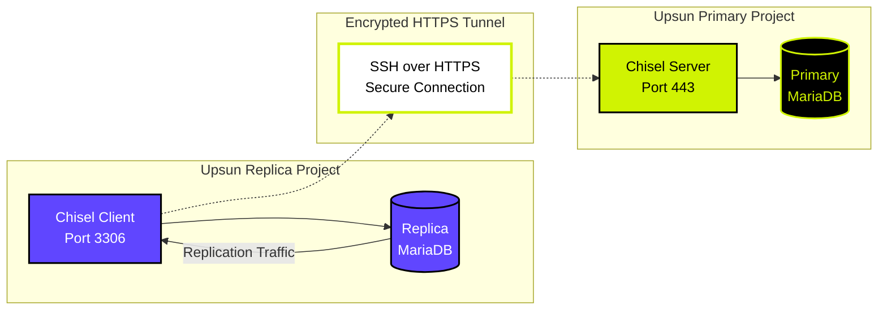

Upsun's [mesh networking](/posts/how-upsun-built-stateless-mesh-networking-for-high-density-containers/) provides excellent isolation and security between projects by design, preventing unauthorized cross-project communication. While this isolation is a security feature, there are legitimate scenarios where you need controlled connectivity between projects.

This tutorial demonstrates how to use [**Chisel**](https://github.com/jpillora/chisel), a fast, secure TCP/UDP tunnel transported over HTTP, to create encrypted connections between services running on different Upsun projects. We'll walk through setting up MariaDB replication between two projects as a practical example.

## Prerequisites

Before starting, ensure you have:

- Two Upsun projects (we'll call them `primary-db` and `replica-db`)
- Basic understanding of Upsun project configuration
- Access to the [Upsun CLI](https://docs.upsun.com/administration/cli.html) (`upsun` command)
- Familiarity with MariaDB or MySQL databases

## Understanding Upsun project isolation

Upsun's architecture intentionally isolates projects from each other.

- **Isolated projects**: Projects containers cannot directly communicate with another container in another project
- **Secure ingress**: Only designated routes are publicly accessible
- **Internal service discovery**: Applications can only be linked to services within their own project

While project isolation is recommended, this can prevent some legitimate use-cases like sharing a database or a service between multiple applications on different projects.

## Use cases for cross-project connectivity

### Database replication scenarios
- **Cross-region backup**: Replicate data to different geographical regions  
- **Disaster recovery**: Maintain standby databases in separate projects
- **Data warehousing**: Extract data from production to analytics projects

In case of an incident, having a cloned database on another region will allow you to optimize the **Recovery Time Objective** (RTO) & **Recovery Point Objective** (RPO) by switching the production instance to the second project through DNS.

### Service integration patterns
- **Legacy system integration**: Connect modern applications with legacy services
- **Microservices architecture**: Bridge services temporarily or permanently
- **Multi-tenant isolation**: Connect tenant-specific services across projects

It's important to note that both projects could be running on different Upsun regions and even different cloud providers. However, a connection between two isolated regions can introduce some latency due to the network usage between the endpoints.

## What is Chisel?

[Chisel](https://github.com/jpillora/chisel) is an open-source tunneling solution that creates secure, encrypted connections over HTTP/HTTPS. Key features include:

- **SSH-encrypted tunnels**: All traffic is encrypted using SSH protocol
- **HTTP transport**: Tunnels work through firewalls and proxy servers
- **Reverse port forwarding**: Services can expose ports securely across networks
- **Single binary**: Easy to deploy with no external dependencies
- **Auto-reconnection**: Maintains stable connections with exponential backoff

### How Chisel works

Chisel operates with a client-server model:

1. **Chisel Server**: Runs on the target project and listens for connections
2. **Chisel Client**: Connects to the server and creates local tunnel endpoints
3. **Encrypted Tunnel**: All traffic flows through SSH-encrypted HTTP connections

## Setting up the MariaDB replication example

Now let's implement a practical example: setting up MariaDB replication between two Upsun projects using Chisel tunnels.

### Architecture overview

Our setup includes:
- **Primary Project** (`primary-db`): Hosts the primary MariaDB instance
- **Replica Project** (`replica-db`): Hosts the replica MariaDB instance  
- **Chisel Server**: Runs alongside the primary database
- **Chisel Client**: Runs alongside the replica database
- **Encrypted Tunnel**: Connects replica to primary for replication traffic



### Step 1: Configure the primary database project

First, let's set up the primary database with MariaDB and Chisel server.

Create `.upsun/config.yaml` in your primary project:

```yaml {filename=".upsun/config.yaml"}
services:
  maindb:
    type: mariadb:11.8
    configuration:
      rotate_passwords: false
      schemas:
        - main
      endpoints:
        mysql:
          default_schema: main
          privileges:
            main: admin
        replicator:
          privileges:
            main: replication

applications:
  app:
    type: golang:1.24
    relationships:
      db:
        service: maindb
        endpoint: mysql
      replication:
        service: maindb
        endpoint: replicator
    hooks:
      build: go install github.com/jpillora/chisel@latest
    web:
      commands:
        start: chisel server
      locations:
        "/":
          passthru: true
          request_buffering:
            enabled: false

routes:
  https://{default}/:
    type: upstream
    upstream: app:http
    cache:
      enabled: false
```

#### Configuration breakdown

**Services section:**
- `maindb`: MariaDB 11.4 service with two endpoints:
  - `mysql`: Standard admin endpoint for general database operations
  - `replicator`: Dedicated endpoint with `replication` privileges for replica connections
- `rotate_passwords: false`: Keeps passwords stable for replication connections

**Application section:**
- `type: golang:1.24`: Uses Go runtime (Chisel is a golang application)
- `relationships`: Creates two database connections:
  - `db`: Admin access to the database
  - `replication`: Replication-only access for the replica to connect to
- `hooks.build`: Installs Chisel during the build phase
- `web.commands.start`: Runs Chisel server as the web process
- `locations`: Configures HTTP handling with passthrough and disabled request buffering

**Routes section:**
- Exposes the Chisel server publicly via HTTPS
- Disables caching for real-time tunnel connections to be made over WebSockets


#### Deploy the primary project

Once added to your project, push the updated configuration to deploy the project:

```bash {filename="Terminal"}
git add .upsun/config.yaml
git commit -m "Setup Chisel server on primary project"
upsun push
```

Once deployed, you will be able to see the newly created endpoint for the chisel server:

```bash {filename="Terminal"}
Environment configuration
    app (type: golang:1.24, cpu: 0.1, memory: 64, disk: 0)
    maindb (type: mariadb:11.4, cpu: 1.0, memory: 2432, disk: 512)

  Environment routes
    http://main-bvxea6i-qwoo2yqnr6vgq.eu-3.platformsh.site/ redirects to https://main-bvxea6i-qwoo2yqnr6vgq.eu-3.platformsh.site/
    https://main-bvxea6i-qwoo2yqnr6vgq.eu-3.platformsh.site/ is served by application `app`
```

You're going to need to keep 2 bits of information on the replica project:

- The URL of this environment, here `https://main-bvxea6i-qwoo2yqnr6vgq.eu-3.platformsh.site/`
- The password needed for the `replication.internal` relationship

You can grab the password as such:

``` {filename="Terminal"}
# SSH into primary project
upsun ssh -A app

# Grab the password from the relationships
echo $PLATFORM_RELATIONSHIPS | base64 -d | jq -r '.replication[0].password'
```

### Step 2: Configure the replica database project

The `replicator` endpoint in the primary configuration automatically creates the replication user with proper privileges, no manual SQL setup required!

Create `.upsun/config.yaml` in your replica project:

```yaml {filename=".upsun/config.yaml"}
services:
  replicadb:
    type: mariadb:11.4
    configuration:
      schemas:
        - main
      endpoints:
        replica-admin:
          default_schema: main
          privileges:
            main: replication-admin
    relationships:
      primary: app:http

applications:
  app:
    type: golang:1.24
    hooks:
      build: go install github.com/jpillora/chisel@latest
    web:
      commands:
        start: chisel client https://main-bvxea6i-qwoo2yqnr6vgq.eu-3.platformsh.site/ 0.0.0.0:3306:replication.internal:3306
  admin:
    type: golang:1.24
    relationships:
      db: replicadb:replica-admin

routes:
  https://{default}/:
    type: upstream
    upstream: admin:http
```

While we are hardcoding the endpoint in this example, you could also use the Upsun CLI in the environment to dynamically retrieve the correct route of the other project.

**Configuration breakdown:**

**Services section:**
- `replicadb`: Local MariaDB instance that will serve as the replica
- Single `replica-admin` endpoint with `replication-admin` privileges for managing the replica
- A relationship from that MariaDB instance to the application

**Applications section:**
- `app`: Chisel client application that creates the tunnel
  - `hooks.build`: Installs Chisel during build
  - `web.commands.start`: Runs Chisel client with specific tunnel configuration:
    - Connects to the primary server at `https://main-bvxea6i-qwoo2yqnr6vgq.eu-3.platformsh.site/`. This is the URI generated at the previous step.
    - Creates tunnel: `0.0.0.0:3306:replication.internal:3306`
    - This forwards local port 3306 to the primary's replication endpoint
- `admin`: Application managing the local MariaDB instance (circular relationships are not allowed, so a separate application is needed)

⚠︎ Because both projects are independent, the endpoint route might change based on the other project configuration.

**Tunnel configuration explained:**
- `0.0.0.0:3306`: Binds to all interfaces on port 3306 (MySQL default)
- `replication.internal:3306`: Connects to the primary's replication endpoint
- The `replication.internal` hostname corresponds to the `replication` relationship defined in the primary project

With this setup, when the local MariaDB instance will connect to the `app` application via the relationship, it will be tunneled to the remote MariaDB instance.

**Routes section:**
- Routes traffic to the admin application for managing/querying the replica

#### Deploy the replica project

Once added to your project, push the updated configuration to deploy the project:

```bash {filename="Terminal"}
git add .upsun/config.yaml
git commit -m "Setup Chisel client on replica project"
upsun push
```

Once deployed, you need to configure your local MariaDB instance as a replica of the remote one:

``` {filename="Terminal"}
# SSH into replica project
upsun ssh -A replica-db

# Set the local MariaDB instance as a replica of the remote one
mysql -u main -p -h database.internal -e "CHANGE MASTER TO MASTER_HOST = 'primary.internal', MASTER_PASSWORD='<previously saved password>';"

# Start the replication on the local MariaDB instance
mysql -u main -p -h database.internal -e "START REPLICA;"
```

From there on, the replica should automatically connect to the primary project Chisel server endpoint, retrying as necessary.

### Step 3: Verify replication is working

Connect to your replica database and check replication status:

```bash {filename="Terminal"}
# SSH into replica project
upsun ssh -A replica-db

# Check slave status
mysql -u main -p -h database.internal -e "SHOW REPLICA STATUS\G"
```

You should see output indicating the replica is connected and replicating from the primary.

Test data synchronization:

```bash {filename="Terminal"}
# SSH into primary project
upsun ssh -A primary-db

# Add test data
mysql -u main -p -h database.internal sample_db -e "INSERT INTO users (name, email) VALUES ('Test User', 'test@example.com');"

# SSH into replica and verify data appears
upsun ssh -A replica-db
mysql -u main -p -h database.internal sample_db -e "SELECT * FROM users;"
```

## Key advantages of this setup
- **Secure tunnel**: All replication traffic flows through encrypted Chisel tunnel
- **Minimal configuration**: No custom scripts needed. Chisel handles everything
- **Runtime agnostic**: Works with any Upsun runtime (Go, Python, Node.js, PHP, etc.)
- **Production ready**: Built-in auto-reconnection and error handling
- **Cost effective**: Because the Chisel application is mostly a proxy, it can work with 0.1 CPU

## Alternative approaches

While Chisel provides excellent flexibility, consider these alternatives:

### Upsun-native patterns
- **Data export/import**: Use regular data dumps and imports for less critical scenarios
- **Message queues**: Use RabbitMQ or Redis for event-driven data synchronization  
- **API-based sync**: Build REST/GraphQL APIs for controlled data access
- **Shared storage**: Use external object storage for file-based data sharing

### When to avoid cross-project connectivity
- **Simple data sharing**: Use APIs instead of direct database access
- **Occasional data sync**: Manual export/import may be simpler
- **High-security environments**: Additional network paths increase attack surface
- **Performance-critical paths**: Direct database connections may introduce latency

## Conclusion

Chisel provides a powerful solution for creating secure, encrypted tunnels between Upsun projects when legitimate connectivity requirements arise. 

Remember that project isolation is a valuable security feature. Use cross-project connectivity with caution and always implement appropriate security controls including strong authentication, encrypted connections, and comprehensive monitoring.

For additional help with networking and connectivity patterns, join the [Upsun Discord community](https://discord.com/invite/platformsh/) or [schedule a consultation](https://upsun.com/contact-us/) with our technical team.

## Additional resources

- [Chisel project documentation](https://github.com/jpillora/chisel)  
- [Upsun documentation](https://docs.upsun.com/)
- [MariaDB replication guide](https://docs.upsun.com/add-services/mysql.html#replication)
- [Upsun multi-application projects](https://docs.upsun.com/create-apps.html#use-multiple-apps)
